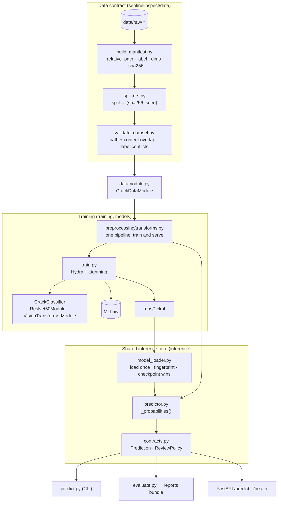

# Architecture

How SentinelInspect is put together, and why the boundaries sit where they do.

---

## The shape of it



---

## Four boundaries, and what each one buys

### 1 · The dataset is a file, not a directory

Training never walks `data/raw/`. It reads `train.csv`. That CSV is an artifact you can
commit, diff, hash and hand to someone else, so "what was this model trained on?" has an
exact answer. Dropping new images into `data/raw/` changes nothing until you deliberately
rebuild the manifest.

The manifest records `relative_path` and `sha256` and **no absolute path**. An absolute
path makes the contract specific to one machine and one directory name — renaming the
project once invalidated all 40,000 rows.

### 2 · Splits are a pure function of content

```python
def assign_split(key, train_ratio, val_ratio, seed=42):
    score = stable_hash_to_unit_interval(key, seed=seed)
    ...
```

Keyed on `sha256`, so byte-identical images always co-locate and duplicates cannot
straddle the train/test boundary. And because the score depends only on the item, adding
images never moves the ones already assigned.

**The trade-off this accepts:** class balance is approximate rather than exact — measured
drift is under one percentage point. Exact stratification would require ranking within
each class, which makes an item's split depend on every other item and destroys the
stability property. The two are mutually exclusive.

### 3 · Validation reports at two severities

`validate_dataset.validate` returns a `ValidationReport` carrying `errors` and `warnings`,
and raises nothing. The caller decides policy: the datamodule fails on errors, the CLI
exits non-zero, both print warnings.

| Condition | Severity | Why |
| --- | --- | --- |
| Same image in two splits (by content) | **error** | Invalidates every metric |
| Same image, two different labels | **error** | Contradictory training data |
| Duplicate rows or paths within a file | **error** | A build bug |
| Duplicate *content* within one split | warning | Over-weights an image; does not invalidate |
| Missing / corrupt / unreadable files | **error** | The data is not what the manifest claims |
| No `sha256` column at all | warning | Content checks silently cannot run |

The overlap check is one function called twice — once over paths, once over content —
rather than two near-identical loops.

### 4 · One inference core, three adapters

```python
@torch.inference_mode()
def _probabilities(self, batch: torch.Tensor) -> torch.Tensor:
    logits = self.model(batch.to(self.device))
    return torch.softmax(logits, dim=1).cpu()
```

`predict_image`, `predict_images` and `predict_tensor` all go through it. The CLI, the
HTTP route and offline evaluation are thin translation layers.

This is not aesthetic. The project previously built a torchvision transform in `predict.py`
while everything else used albumentations; the measured divergence was 0.035 max tensor
delta. Small, uncontrolled, and structurally guaranteed to grow. A test now asserts that a
prediction from raw bytes and one from a preprocessed tensor agree.

---

## Configuration

Hydra composes `configs/*.yaml` into one tree; Pydantic validates it into a
`RuntimeConfig` before any of it is used.

| Group | Contents |
| --- | --- |
| `data` | manifest and split paths, `raw_root`, batch size, workers |
| `model` | registry key, timm backbone, optimiser, learning rate |
| `trainer` | epochs, accelerator, precision, determinism |
| `mlflow` | tracking URI, experiment name |
| `review` | the `needs_review` confidence band |
| `service` | host and port |

`extra="forbid"` on most schemas turns a typo into an error rather than a silently ignored
key. `extra="allow"` on `ModelConfig` because ViT carries knobs ResNet does not.

`config.paths.config_dir()` resolves the directory absolutely, because `hydra.main`'s
relative `config_path` stops working through an installed console script.

---

## The prediction contract

```json
{
  "predicted_label": "crack",
  "confidence_score": 0.9731,
  "probabilities": {"no_crack": 0.0269, "crack": 0.9731},
  "needs_review": false,
  "review_reason": null,
  "model_metadata": {"name": "...", "checkpoint_sha256": "...", "package_version": "..."},
  "latency_ms": 41.2
}
```

Defined once, in `inference/contracts.py`, as Pydantic models. The service re-exports them
rather than redefining them — a parallel definition would drift the first time a field was
added to one side.

`needs_review` is a two-sided band, not a floor: `p=0.48` and `p=0.52` are equally
uncertain. `model_metadata` exists so a stored prediction can be traced to the weights that
produced it; a filename cannot do that, since two runs happily produce the same one.

---

## Deployment

The API loads the model in FastAPI's `lifespan` handler and re-raises on failure, so a
misconfigured container crash-loops instead of reporting healthy and failing every request.
`/health` returns the checkpoint fingerprint.

The image is multi-stage, runs as an unprivileged user, installs CPU-only torch, and mounts
weights at run time rather than baking them in. MLflow is not a core dependency, which
keeps Flask, SQLAlchemy, alembic, gunicorn and the Docker SDK out of a serving image.

**Known limitation, stated rather than hidden:** `configs/` lives beside the package rather
than inside it, so a non-editable wheel install does not carry it. Editable installs work,
and the container copies configs in and sets `SENTINELINSPECT_CONFIG_DIR`.

---

## Deliberately absent

Batch-inference CLI, drift monitoring, a model registry, prediction persistence,
authentication, queues, Kubernetes, ONNX export, further hyperparameter search. Scope was
fixed at one week with a cut list agreed in advance. See `docs/roadmap.md` for what was
planned and what was actually delivered.
